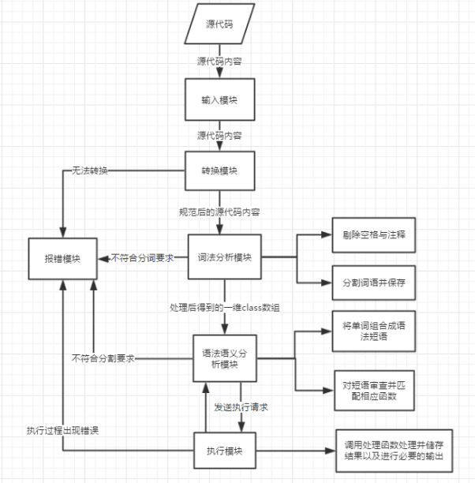

# 整体架构设计 #

## 整体处理流程： ##

  输入模块读入源程序代码

转换模块把源代码预处理也就是规范化之后，词法分析模块将规范化的源码进行处理，分割为最小单元，剔除空格与注释，将代码保存进一维class数组，每格保存一个最小单位，要求记录该单元内容、行数、标记syn值（对应表可知类型）

然后语法语义分析模块先进行语法分析，即在词法分析的基础上将单词序列组合成各类语法短语，然后对结构上正确的源程序进行上下文有关性质的审查, 进行类型审查，对类型对应错误进行报告，对正确的语句生成语法树并执行

之后就是执行模块执行语法树并储存结果

最后就是输出模块在执行程序的过程中以及执行完毕后，输出必要的运行情况和运行结果。

##  流程图  ##

##  各模块工作原理 ##

1、函数分离模块

无输入输出

重新扫描Temp向量，当识别到函数定义时，记录函数名进入函数表，同时将函数位置、形参个数、每个的形参类型记录，将形参加入该函数的变量表，依次完成对所有函数的处理。

2、四则运算模块

输入两操作数（float）和一个操作符，仅被因式分解模块调用
根据算术运算符的匹配结果，对两操作数进行不同的算数运算。

3、函数处理模块

输入调用起始在Temp中的位置（int）和调用语句在Temp中的长度（int）

先通过传递过来的位置和长度分离出函数名、形参类型、个数，与函数处理模块记录的函数表（FTemp）逐一对比，匹配到调用函数的相关信息，用堆栈记录调用前函数在函数表的位置、调用命令位置，然后跳转标记，按主控方式逐行执行子函数内容，遇到return恢复上一次的函数在函数表的位置、调用命令位置变量，跳转回调用位置。

3、主控模块

无输入输出

调用词法分析模块和函数分离模块，对获得的代码字符串进行规范化处理，并记录相应信息，然后逐行（按\n）读取内容，依据=、int、real、string、in、out、return、变量（、if、while等关键字匹配，将该语句发给匹配到的模块，由不同模块进行处理，然后主控读下一行，直至main函数结束。

4、输出模块
  
词法分析传入输出内容的起始位置和长度，输出模块逐一判断，穷举所有情况并输出。
       
`1 out 5，n； out 5,”hello”, out 5,”hello”,n 
2 out n,”hello”  out out n,”hello”, out n,”hello”,n
3 out “n=”, n`

5、 词法分析模块Scaner  

接口：无传入（通过全局变量对数据存储进行修改）。返回值为当前token的标记值。

通过循环匹配，识别出标识符、关键字、变量和数字等等。并对其进行标记，然后将token存入Temp数组中。在进行下一场匹配，直到文件结束。

6、赋值模块 Equall  

接口：first为传入的赋值语句的起始位置，Long为赋值语句的长度（不包括分号’;’）。返回值为int（0或1），为if或while的判断条件做准备。

通过识别出等号左侧内容的类型，将其分别传递给函数处理模块、因式分解模块、串操作模块，然后再把返回值赋值给等式右边的变量。

7、因式分解模块 Factorization  

接口：first为传入的赋值语句的起始位置，Long为赋值语句的长度（不包括分号’;’）。返回值为float（即该因式的最终值）。

因式分解模块首先根据优先级和结合性将因式转换为后缀表达式，然后扫描后缀表达式按照符号类型分别将待处理的数值及符号传入算术运算模块、逻辑运算模块、关系运算模块，将返回值重新加入表达式继续运算。将最终值返回。

8、关系运算模块Relatee

接口：两个float的数值a和b，一个字符c。返回1或0（1表示式子acb成立，反之为0）
通过识别字符c，然后将a和b进行比较，将结果返回。

9、定义语句模块define.cpp
    函数：void Def（int ，int ）；
    输入为处理语句的开头在Temp数组中的位置和该条语句（不包括分号）的长度；无输出。
    支持的语句格式包括：
    类型  变量；     //  eg. Int a;
类型  变量=常量；    //  real a=1;
类型 变量，变量=常量，......； // string a=abcd”,c,d,e;
定义了未初始化的变量默认初始化；
存储在临时变量vtp中，最后压入所在函数表的局部变量表中；

10、输入模块 Inuptt.cpp 

函数：void Inputt(pro *, int )；

输入为语句的首地址和长度；无输出。
支持的语句格式包括

In “内容” 整形变量；

In 整形变量；

先查函数局部变量表，存在就更新变量表，不存在就新建一个单元储存；

11、逻辑运算 

函数：float Logicc(float , float , char )；

输入为两个操作数和一个操作符，输出为float型的返回值，结果为1或0；操作符支持& ，| ， ！；

12、函数返回模块

   函数：v  Ret(int a, int b)；

   输入为返回语句的开始位置和长度；输出为一个v型；

 支持的语句格式：Return 变量 Return  函数；Return 常量；Return 表达式

## 关键算法设计 ##

本产品主要由词法分析模块、函数分离模块、主控模块（语意分析模块）、执行模块四部分组成，核心使用了穷举匹配、递归思想、堆栈处理相结合的处理方式。

1、穷举匹配

主控模块与各个子执行模块判断依据以规定的语法穷举所有可能出现的情况，进行分情况匹配并做对应的操作处理。
如主控可逐行读取内容，依次匹配该行开始内容是够为int、real、string、变量=、变量（、in、out、return、if、while、do等关键字，匹配到后将该行传给相应处理子模块处理，当结果返回后读取下一行，并判定是否主函数结束，若否，重复匹配执行直到结束。
int、real、string	  将该行传给定义模块
变量=			       将该行传给赋值模块
变量				  将该行传给函数模块
In				  将该行传给输入模块
Out				  将该行传给输出模块
Return                将该行传给return处理模块，返回后结束程序（主控只处理主函数）
If	 将该行传给if-else处理模块
While	 将该行传给while处理模块
Do 	 将该行传给do-until模块
对于最底层执行子模块，可依据对应的语法穷举出所有可能处理的情况，并逐一编写处理方案。
如输入模块，情况包括
13
（1）in 变量;
（2）in “提示串”，变量;
变量可为int、real、string三种类型，对应不同输入形式与输入类型，进行分情况处理，
实现相应输入功能。

2、递归思想

部分语句可能涉及多模块处理的情况，此时主要应用递归处理的思想，每个子模块在穷举匹配到相应内容时，如果可交给别的子模块处理，则传给其他模块处理，每次传递将接收的内容缩短，当传递一定次数时，该语句会简化为基础的单一语句，由底层模块进行处理，再逐层操作并返回结果，实现对应的处理。
如语句 int a=3+2*3;该语句涉及定义、赋值、因式分解、四则运算等多过程。当主控读取该语句时，根据匹配的优先级，优先匹配到定义模块，将该语句传给定义模块；定义模块识别后续内容，将变量a存入变量表，同时将a=3+2*3传递给赋值模块；赋值模块识别后续内容，将判定a的类型，同时将3+2*3传给因式分解模块；因式分解将该式子转为后缀表达式23*3+，依次传给四则运算模块；四则运算最终返回9，因式分解将9返回给赋值模块，赋值模块将9存入a，然后将9返回给定义模块，定义模块收到返回值判定定义结束，回到主控模块，主控模块执行下一行。
每一语句的处理都优先考虑缩短内容后可否交给其他模块处理。若可以，就缩短内容并传递；若不能，则再考虑自行处理或将可能多次调用的内容分离成子函数并调用。

3、堆栈处理

在因式分解处理与函数跳转时，产品主要是用了堆栈操作，因式
分解时通过堆栈将中缀表达式转为后缀表达式，再对应弹出交给不
14
同子模块处理；函数跳转是通过堆栈记录原函数在函数表位置和跳
转前行数，当函数读到return时，将两个数据弹出，实现读取行数的跳转。
